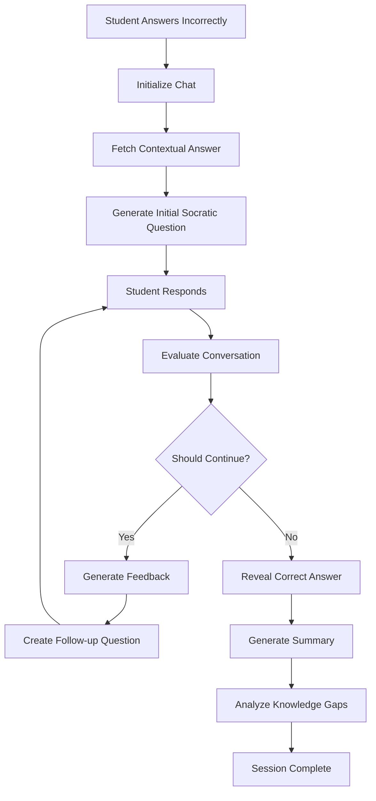
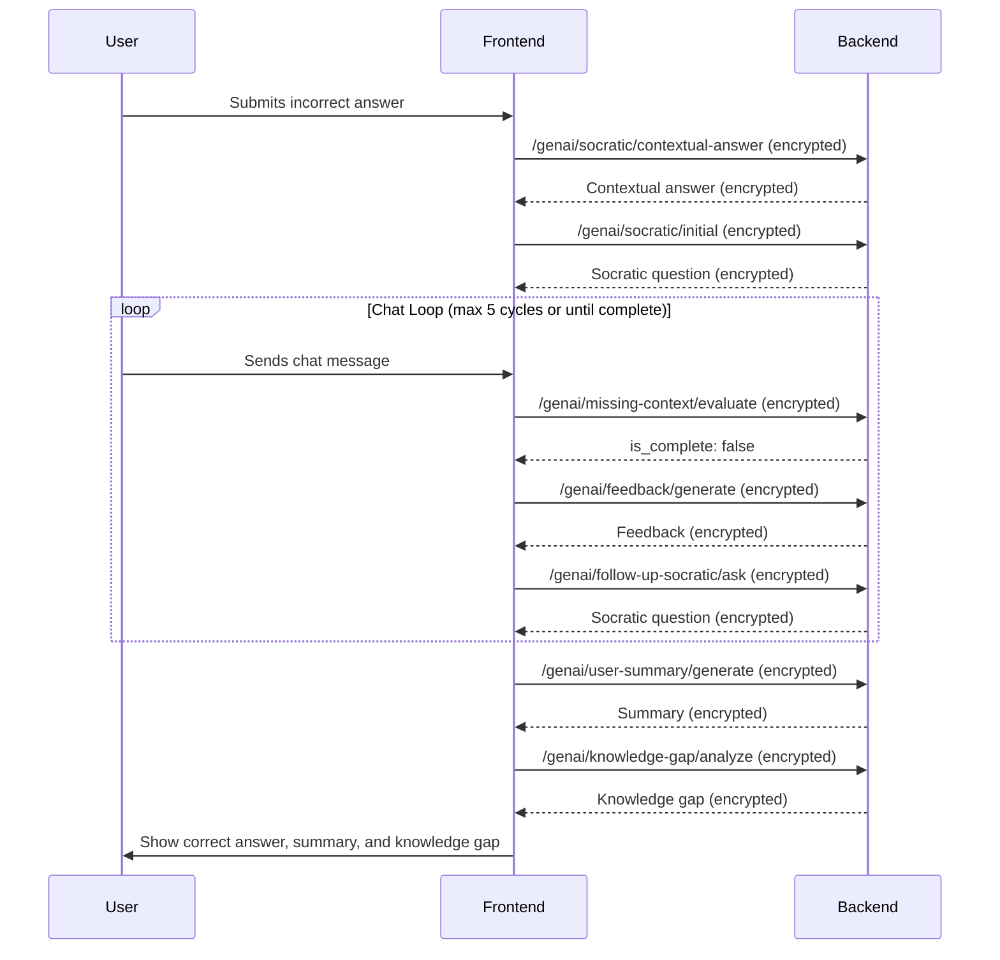

# soc-nextjs-ui

This is a repo for Next JS UI for Soc App

## AI Chat Workflow Documentation

### Overview

The AI chat system is an intelligent tutoring assistant that provides personalized learning support when students answer quiz questions incorrectly. It uses a Socratic method approach with multiple AI services to guide students toward understanding.

### Architecture Components

#### 1. Frontend Components

- **ChatPanel** (`chat-panel.tsx`): Main chat interface with input methods
- **useQuizChat Hook** (`use-quiz-chat.ts`): Core chat logic and state management
- **Quiz Page** (`page.tsx`): Orchestrates quiz and chat integration

#### 2. Input Methods

- **Text Input**: Standard typing
- **Speech Recognition**: Voice-to-text with real-time transcription
- **Math Input**: Image upload for mathematical expressions
- **Drawing Canvas**: Hand-drawn mathematical expressions
- **Math Helper**: Quick math symbol insertion

#### 3. Security Layer

- **Encryption**: AES-256-GCM encryption for all AI communications
- **Secure API Client**: Handles authentication and encryption automatically

### Chat Workflow Process

#### Phase 1: Chat Initialization

**Trigger**: Student answers a question incorrectly

```typescript
// In page.tsx - handleSubmit function
if (!selectedOptionArray?.is_correct) {
  await initializeChat(selectedOptionArray?.option_text || "");
}
```

**Process**:

1. **Question Display**: Shows the original quiz question
2. **User Answer**: Displays the student's incorrect answer
3. **Contextual Answer**: Fetches detailed explanation using `/genai/socratic/contextual-answer`
4. **Initial Socratic Question**: Generates first guiding question using `/genai/socratic/initial`

#### Phase 2: Interactive Learning Session

**Trigger**: Student sends a message in the chat

**Process**:

1. **Message Evaluation**: Checks if conversation should continue using `/genai/missing-context/evaluate`
2. **Feedback Generation**: If continuing, generates personalized feedback using `/genai/feedback/generate`
3. **Follow-up Questions**: Creates next Socratic question using `/genai/follow-up-socratic/ask`
4. **Attempt Tracking**: Records AI-assisted learning session

#### Phase 3: Session Completion

**Trigger**: Conversation reaches completion criteria or 5 feedback cycles

**Process**:

1. **Correct Answer**: Reveals the correct answer
2. **Learning Summary**: Generates personalized summary using `/genai/user-summary/generate`
3. **Knowledge Gap Analysis**: Identifies areas for improvement using `/genai/knowledge-gap/analyze`

### Message Types

```typescript
interface Message {
  id: number;
  sender: "user" | "response";
  content: string;
  timestamp: string;
  type?:
    | "feedback"
    | "question"
    | "summary"
    | "knowledge-gap"
    | "Actual-Answer";
}
```

- **`feedback`**: Personalized guidance and explanations
- **`question`**: Socratic questions to guide learning
- **`summary`**: Final learning summary
- **`knowledge-gap`**: Identified areas for improvement
- **`Actual-Answer`**: Correct answer revelation

### API Endpoints Used

#### Core AI Services (Encrypted)

```typescript
// Contextual understanding
POST / genai / socratic / contextual - answer;

// Initial Socratic question
POST / genai / socratic / initial;

// Conversation evaluation
POST / genai / missing - context / evaluate;

// Feedback generation
POST / genai / feedback / generate;

// Follow-up questions
POST / genai / follow - up - socratic / ask;

// Learning summary
POST / genai / user - summary / generate;

// Knowledge gap analysis
POST / genai / knowledge - gap / analyze;
```

#### Progress Tracking

```typescript
// Update quiz attempt with AI assistance
PATCH /user-quiz-attempts/quiz-attempts/
```

### State Management

#### Chat State

```typescript
const [messages, setMessages] = useState<Message[]>([]);
const [isTyping, setIsTyping] = useState(false);
const [contextAnswer, setContextAnswer] = useState("");
const [actualAnswer, setActualAnswer] = useState("");
const [conversationMessages, setConversationMessages] = useState<
  ConvoMessage[]
>([]);
const [feedbackCounter, setFeedbackCounter] = useState(0);
```

#### Quiz Integration State

```typescript
const [selectedOption, setSelectedOption] = useState<number | null>(null);
const [isAnswerChecked, setIsAnswerChecked] = useState(false);
const [isCorrect, setIsCorrect] = useState(false);
const [currentquestionId, setCurrentquestionId] = useState<number | null>(1);
```

### Security Implementation

#### Encryption Flow

1. **Client-Side**: Payload encrypted using AES-256-GCM
2. **Transmission**: Encrypted data sent with `X-Encrypted: true` header
3. **Server-Side**: Decryption and processing
4. **Response**: Encrypted response with same security

#### Authentication

- Bearer token authentication
- Automatic token management
- Secure storage in localStorage

### User Experience Features

#### Real-Time Feedback

- **Typing Indicators**: Shows when AI is processing
- **Speech Recognition**: Real-time transcription with confidence scoring
- **Auto-scroll**: Automatic chat scrolling to latest messages
- **Error Handling**: Graceful error messages and retry mechanisms

#### Accessibility

- **Speech-to-Text**: Voice input support
- **Text-to-Speech**: Audio output for responses
- **Keyboard Navigation**: Full keyboard accessibility
- **Visual Indicators**: Clear status and feedback indicators

### Error Handling

#### Network Errors

```typescript
catch (error) {
  console.error("❌ Error sending message:", error);
  addMessage({
    sender: "response",
    content: "Sorry, I encountered an error processing your message. Please try again.",
  });
}
```

#### Speech Recognition Errors

- Microphone permission issues
- Network connectivity problems
- Browser compatibility checks
- Automatic error clearing after 5 seconds

### Performance Optimizations

#### Chat Management

- **Message Batching**: Efficient message updates
- **Memory Management**: Automatic cleanup of old conversations
- **Lazy Loading**: On-demand chat initialization
- **Debounced Input**: Prevents excessive API calls

#### State Optimization

- **Memoized Callbacks**: Prevents unnecessary re-renders
- **Ref-based Scrolling**: Efficient scroll management
- **Conditional Rendering**: Only render active components

### Integration Points

#### Quiz System Integration

- **Question Context**: Passes question details to chat
- **Answer Validation**: Triggers chat on incorrect answers
- **Progress Tracking**: Records learning sessions
- **Navigation**: Resets chat when changing questions

#### Learning Analytics

- **Attempt Tracking**: Records AI-assisted sessions
- **Completion Metrics**: Tracks learning progress
- **Knowledge Gaps**: Identifies improvement areas
- **Time Tracking**: Measures learning session duration

### Configuration

#### Environment Variables

```typescript
ENCRYPTION_SECRET_KEY: "your-32-character-secret-key-here!";
NEXT_PUBLIC_API_BASE_URL: "http://localhost:8000/api/v1";
```

#### API Configuration

```typescript
const API_CONFIG = {
  BASE_URL:
    process.env.NEXT_PUBLIC_API_BASE_URL || "http://localhost:8000/api/v1",
  TIMEOUT: 30000, // 30 seconds
};
```

### Best Practices

#### Security

- Always use encrypted API calls for AI services
- Validate all user inputs
- Implement proper error handling
- Use secure token storage

#### Performance

- Implement proper loading states
- Use debouncing for user inputs
- Optimize re-renders with React.memo
- Handle large conversation histories efficiently

#### User Experience

- Provide clear feedback for all actions
- Implement graceful error recovery
- Support multiple input methods
- Ensure accessibility compliance

### File Structure

```
soc-nextjs-ui/
├── components/quiz/
│   ├── chat-panel.tsx          # Main chat interface
│   ├── chat-message.tsx        # Individual message component
│   ├── typing-indicator.tsx    # Loading animation
│   └── speech-button.tsx       # Voice input control
├── hooks/
│   ├── use-quiz-chat.ts        # Core chat logic
│   ├── use-speech-recognition.ts # Voice input handling
│   └── use-math-input.ts       # Math expression processing
├── lib/
│   ├── secure-api-client.ts    # Encrypted API client
│   ├── encryption.ts           # Encryption utilities
│   └── api-client.ts           # Standard API client
└── app/(dashboard)/quiz/
    └── page.tsx                # Quiz page with chat integration
```

### Data Flow Diagram



## AI Chat Functional Flow (APIs & Implementation)

### 1. Trigger: Incorrect Answer

- When a user answers a quiz question incorrectly, the chat process is triggered.
- The frontend calls `initializeChat(userAnswer)` from the `useQuizChat` hook.

---

### 2. Chat Initialization

#### a. Contextual Answer

- **API:** `POST /genai/socratic/contextual-answer`
- **Request:** Encrypted payload containing the quiz question.
- **Backend:**
  - Decrypts the payload.
  - Calls `get_actual_answer` (OpenAI or similar LLM) to generate a detailed explanation.
  - Returns the AI's contextual answer.

#### b. Initial Socratic Question

- **API:** `POST /genai/socratic/initial`
- **Request:** Encrypted payload with the question, AI's contextual answer, correct answer, and user answer.
- **Backend:**
  - Decrypts the payload.
  - Calls `get_first_soc_question` to generate a Socratic follow-up question.
  - Returns the Socratic question.

---

### 3. Interactive Chat Loop

#### a. User Sends a Message

- The user types or speaks a message, which is sent via `sendMessage(content)`.

#### b. Evaluate Conversation Progress

- **API:** `POST /genai/missing-context/evaluate`
- **Request:** Encrypted payload with the question, conversation history, and correct answer.
- **Backend:**
  - Decrypts the payload.
  - Calls `get_missing_context` to check if the user's understanding is complete.
  - Returns `is_complete: true/false`.

#### c. If Not Complete (and feedback cycles < 5):

##### i. Generate Feedback

- **API:** `POST /genai/feedback/generate`
- **Request:** Encrypted payload with the latest Socratic question, user message, and contextual answer.
- **Backend:**
  - Decrypts the payload.
  - Calls `feedback_pipeline` to generate personalized feedback.
  - Returns feedback.

##### ii. Generate Follow-up Socratic Question

- **API:** `POST /genai/follow-up-socratic/ask`
- **Request:** Encrypted payload with the question, user answer, correct answer, conversation history, and contextual answer.
- **Backend:**

  - Decrypts the payload.
  - Calls `socratic_response_pipeline` to generate the next Socratic question.
  - Returns the question.

- The chat loop continues: user responds, and the above steps repeat.

---

### 4. Chat Completion

#### a. If Complete (or after 5 feedback cycles):

##### i. Reveal Correct Answer

- The correct answer is shown to the user.

##### ii. Generate Learning Summary

- **API:** `POST /genai/user-summary/generate`
- **Request:** Encrypted payload with the question, conversation history, and correct answer.
- **Backend:**
  - Decrypts the payload.
  - Calls `get_user_summary` to generate a summary of the learning session.
  - Returns the summary.

##### iii. Knowledge Gap Analysis

- **API:** `POST /genai/knowledge-gap/analyze`
- **Request:** Encrypted payload with the conversation history and correct answer.
- **Backend:**
  - Decrypts the payload.
  - Calls `get_knowledge_gap` to analyze and return knowledge gaps.

---

### 5. Security

- **All requests/responses are AES-GCM encrypted.**
- **Authentication** is enforced via `get_current_user` dependency in all endpoints.

---

### 6. Sequence Diagram



---

### 7. Key API Endpoints

| Endpoint                            | Purpose                                   |
| ----------------------------------- | ----------------------------------------- |
| `/genai/socratic/contextual-answer` | Get detailed explanation                  |
| `/genai/socratic/initial`           | Get first Socratic question               |
| `/genai/missing-context/evaluate`   | Check if user's understanding is complete |
| `/genai/feedback/generate`          | Generate feedback                         |
| `/genai/follow-up-socratic/ask`     | Get next Socratic question                |
| `/genai/user-summary/generate`      | Generate learning summary                 |
| `/genai/knowledge-gap/analyze`      | Analyze knowledge gaps                    |
